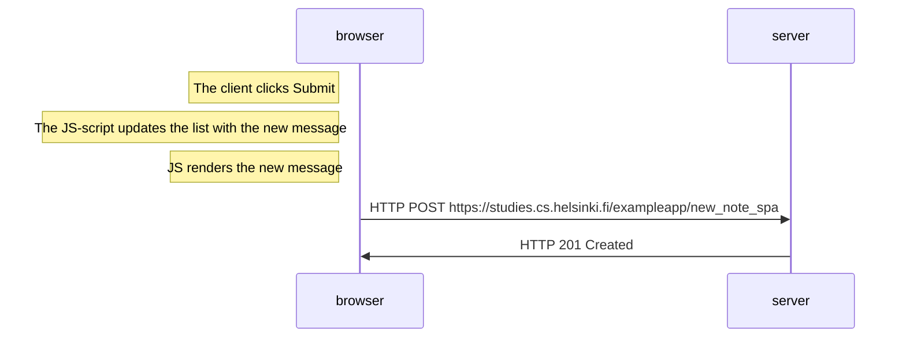

```mermaid
sequenceDiagram
Note left of browser: The client clicks Submit
Note left of browser: The JS-script updates the list with the new message
Note left of browser: JS renders the new message 
browser->>server: HTTP POST https://studies.cs.helsinki.fi/exampleapp/new_note_spa
server->>browser: HTTP 201 Created

```
