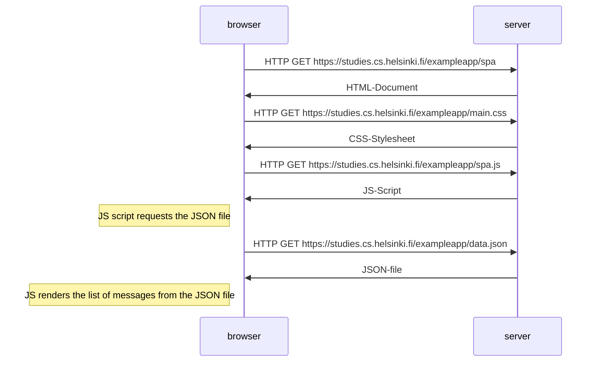

```mermaid
sequenceDiagram
browser->>server: HTTP GET https://studies.cs.helsinki.fi/exampleapp/spa
server->>browser: HTML-Document
browser->>server: HTTP GET https://studies.cs.helsinki.fi/exampleapp/main.css
server->>browser: CSS-Stylesheet
browser->>server: HTTP GET https://studies.cs.helsinki.fi/exampleapp/spa.js
server->>browser: JS-Script
Note left of browser: JS script requests the JSON file
browser->>server: HTTP GET https://studies.cs.helsinki.fi/exampleapp/data.json
server->>browser: JSON-file
Note left of browser: JS renders the list of messages from the JSON file
```
